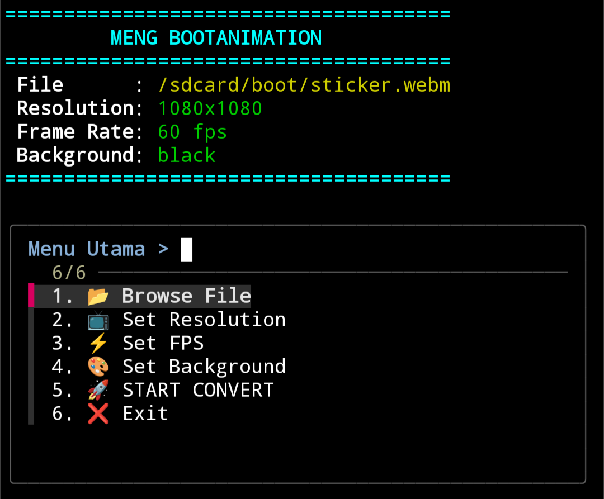

<div align="center">

<a href="https://github.com/juns37/mkboot">
  
</a>

[](CHANGELOG.md)

---



---

Bootanimation Build Process

Gif / vidio ➭ Png (sesuai fps) ➭ buat background (sesuai reso) ➭ add png ditengah (kalau reso png lebih besar akan diperkecil ➭ buat file desc.txt ➭ pack jadi bootanimation.zip   

**Compatible with all device.**
</div>

---

## Update repository..
```
pkg update && pkg upgrade -y
```

## Install semua tool yang dibutuhkan script..
1. fzf: untuk menu interaktif
2. ffmpeg: untuk olah video
3. imagemagick: untuk olah gambar (magick)
4. zip: untuk membuat file bootanimation.zip
```
pkg install python git fzf ffmpeg imagemagick zip -y
```

## Memberikan izin penyimpanan internal (penting untuk /sdcard/boot)
```
termux-setup-storage
```

## Install mkboot tools..
```
curl -fsSL https://raw.githubusercontent.com/juns37/mkboot/main/setup.sh | bash
```

## Usage..
```
mkboot
```
